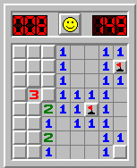

# Minesweeper-Game
Minesweeper is a single-player puzzle computer game. The objective of the game is to clear a rectangular board containing hidden "mines" or bombs without detonating any of them, with help from clues about the number of neighboring mines in each field.

## Instructions for Minesweeper

### Controls

- reveal x y : to check the content of that cell (x = width, y = height) 
- mark x y   : to mark that cell as bomb (x = width, y = height)
- unmark x y : to unmark cell which decide as bomb (x = width, y = height)
- help       : to get help
- quit       : to quit the game

### Quick Start

- Minesweeper a b c (a = width, b = height, c = number of mines)
- Some squares contain mines (bombs), others don't. If you click on a square containing a bomb, you lose. If you manage to click all the squares (without clicking on any bombs) you win.
- Revealing a cell which doesn't have a bomb reveals the number of neighbouring cells containing bombs. Use this information plus some guess work to avoid the bombs.
- To open a cell, get the location of the cell and run command reveal x y. To mark a cell you think is a bomb, get the location of the cell and run command mark x y. 

### Symbols

- #: Unknown
- x: Marked as bomb
- *: Mine (Bomb)
- .: Zero bombs around the cell

### Detailed Instructions

- If you open a cell with 0 neighboring bombs, all its neighbors will automatically open. This can cause a large area to automatically open.
- If you mark a bomb incorrectly, you will have to correct the mistake before you can win. Incorrect bomb marking doesn't kill you, but it can lead to mistakes which do.
- You have to mark all the bombs correctly to win.
